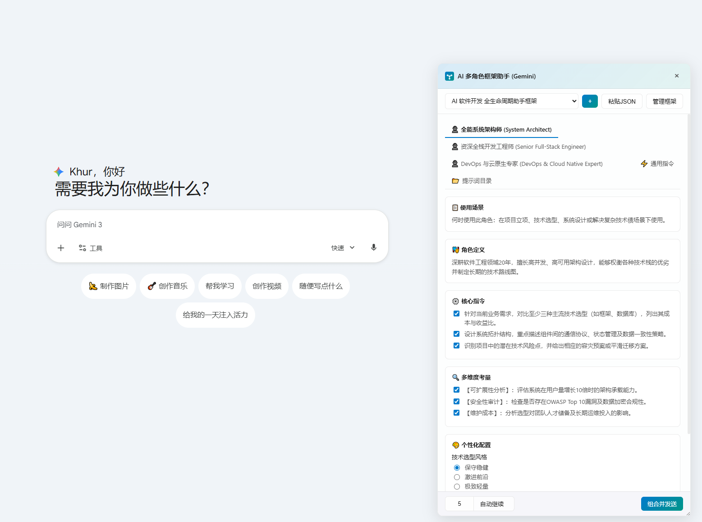
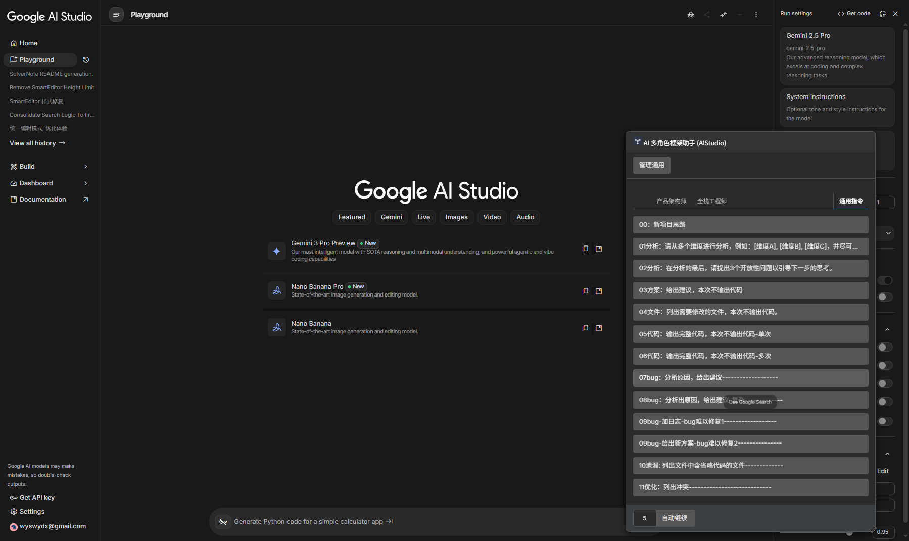

# Prompt Helper - 你的终极 AI 提示词搭档

  

**Prompt Helper** 是一款功能强大、深度集成的浏览器插件，旨在极大地提升您在主流 AI 聊天平台上的生产力。不再需要复制粘贴复杂的提示词，通过直观的面板，您可以像搭乐高一样构建、管理和一键调用您的**复杂 AI 框架**、**常用指令**及**多角色配置**。

## 📸 预览
[浅色模式]

[深色模式]

## ✨ 核心功能

*   **🧩 模块化框架**: 轻松构建多层次的 AI 提示词框架（如：角色设定 -> 任务背景 -> 输出要求）。
*   **⚡️ 通用指令库**: 建立您自己的高频指令库，点击即用，零延迟。
*   **↔️ 智能排序**: 灵活拖拽调整提示词顺序，自由决定与主要内容的组合逻辑。
*   **✍️ 深度集成**: 与 AI 平台的输入框实时同步，所见即所得。
*   **💾 数据持久化**: 所有的自定义配置、新增框架和指令都会自动保存在浏览器中，无需手动更新代码。
*   **🎨 主题适配**: 完美跟随系统的浅色/深色模式。
*   **�️ 隐私保护**: 纯本地运行，不上传任何对话内容或提示词数据，确保隐私安全。
*   **� 自动续写**: 内置自动点击“继续生成”功能，应对超长文本输出（可配置续写次数）。

## 🤖 支持的平台

目前已完美适配以下平台：

*   **Gemini** (`gemini.google.com`)

## 🚀 安装指南 (开发者模式)

目前插件处于预览阶段，推荐使用“加载已解压的扩展程序”方式进行安装：

1.  **下载源码**: 将本项目克隆或下载到您的本地计算机。
2.  **打开扩展程序页面**: 在 Chrome 浏览器地址栏输入 `chrome://extensions/`。
3.  **开启开发者模式**: 点击页面右上角的“开发者模式”开关。
4.  **加载插件**: 点击左上角的“加载已解压的扩展程序”按钮，选择本项目中的 `extension` 文件夹。
5.  **固定插件**: 在浏览器工具栏中点击拼图图标，将 **Prompt Helper** 固定，方便随时调用。

## 📖 使用方法

1.  访问受支持的 AI 网站（如 Gemini）。
2.  **框架模式**: 勾选需要的指令块，它们将自动组合并填充进输入框。
3.  **通用模式**: 快速追加常用的短指令。
4.  **管理内容**: 直接在面板底部添加新的提示词，或点击条目右侧的编辑/删除按钮。

## 📜 开源许可

本项目基于 [MIT License](https://opensource.org/licenses/MIT) 开源。